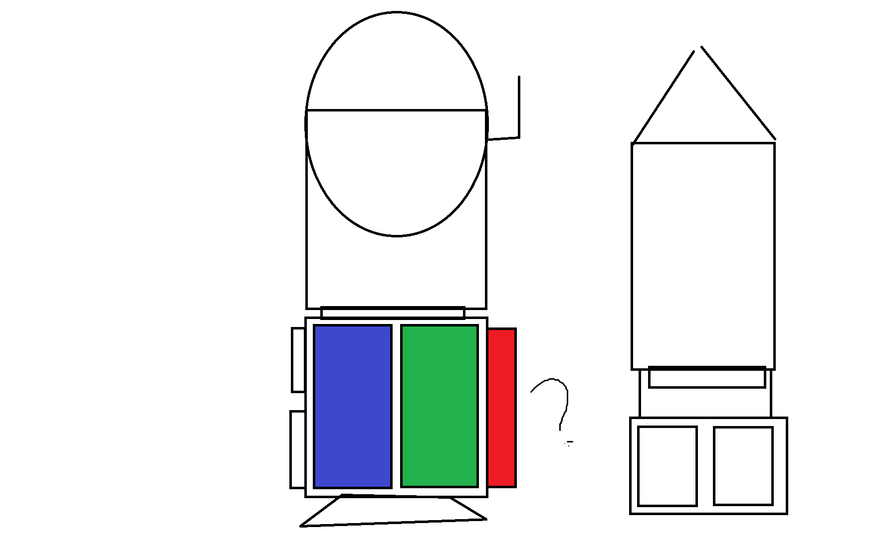

## Идеи и механики, которые могут быть добавлены в игру в будущем

### Типы ракет и их функции

- Обычная ракета - исследовательская ракета (долетает до места в космосе, собирает информацию) - обычная ракета без оружия и грузовых отсеков. Основная задача этой ракеты - исследовать космические пространства на предмет полезных ресурсов и пригодных для колонизации систем

- Добывющая ракета (Mining rocket) - имеет грузовой отсек, основная задача этой ракеты - добывать ресурсы и заниматься их транспортировкой. (можно будет или добавить шахтёрский отсек к существующей грузовой ракете, или создать полностью новую модель). Возможно использовать прицеп для более рискованной игры 

- Космический истребитель - основные задача: защищать другие типы ракет (обеспечивать выполнение миссии для других ракет), уничтожать препятсвия(метеориты), атаковать вражеские ракеты. Если истребитель нападает (вторгается в чужую миссию), то его задача - помешать миссии хоста 

- Инженерная ракета - может чинить все другие ракеты и отсеки, но не имеет оружия

- Грузовая ракета (пассажиры, ресурсы, припасы и.т.д) - перевозка группы людей для колонизации систем, ресурсов для производства, припасов для защиты

### Режимы игры

### События и галактическая карта

- Подумать о случайных событиях во время игры

- Обдумать возможность реализации (небольшой) галактической карты, в которой можно выбирать место прибытия и тип миссии
  
- Возможные типы миссий: исследовательская(долететь до точки, узнать что там находится), добыча ресурсов (и их доставка), грузовая(доставить людей, ресурсы, припасы и т д)

### Варианты прокачки (от легкой реализации к сложной)

1. 4 базовых ракеты одинаковые для всех стран у которых можно пассивно развивать урон, вместимость базового груза и скорость хилла. Для каждой страны меняются раскраски ракет

2. 4 базовых ракеты для всех стран, где прокачка реализуется через модульную систему. Для каждой ракеты есть свои модули. При установке новых модулей улучшаются параметры самой ракеты (урон, вместимость отсеков, скорость исцеления и прочее)

3. Условно 8 стран, для которых есть 4 типа ракет. То есть суммарно 32 ракеты (условно). Прокачка также пассивная для статов разных типов ракет как в 1 пункте. То есть можно выбрать фракцию и развивать её как в WoT

4. Куча модулей для ракет из 32 стран

### Прототип шахтёрской/грузовой ракеты

